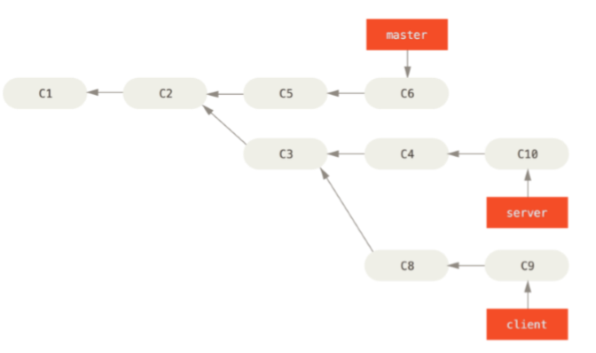
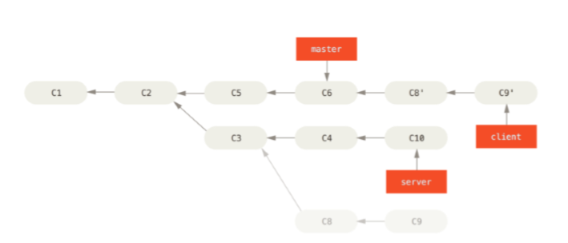
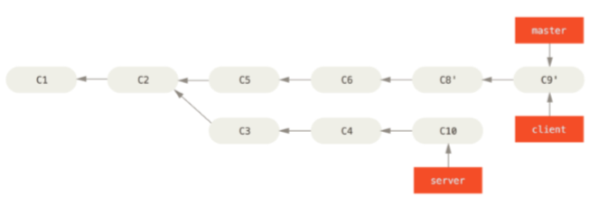
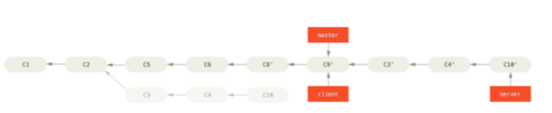

# Rebasing #
### MASTER / SERVER / CLIENT ###
Git baseline


1. CLIENT -> main line 
    ```bash
    $ git rebase --onto master server client
    $ git merge master #updating feature
    ```
    CLIENT was added to main line  
    \

2. CLIENT -> MASTER
    ```bash
    $ git checkout master
    $ git merge client
    ```  
    CLIENT was merged to MASTER
    

3. SERVER -> main line 
    ```bash
    $ git rebase master server #git rebase [basebranch] [topicbranch]
    $ git merge client
    ```   
    SERVER was added to main line  
    

4. SERVER -> MASTER
    ```bash
    $ git checkout master
    $ git merge server
    ```  