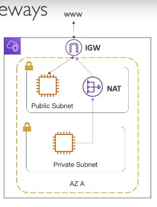

### VPC  ###
* VPC
    * a  private network to deploy your resources 
* Subnets
    * allow you to partition your network inside your VPC (Availability Zone resource)
    * a public subnet is a subnet that is accessible from the internet
    * a private subnet is a subnet that is not accessible from the internet
    * to define access to the internet and between subnets, we use Route Table
              
    * one public subnet per AZ
* Internet Gateways "IGW", NAT Gateways
 
    * IGW - public subnet or NAT to the Internet
        * helps our VPC instances connect with the internet
        * public Subsnets have a route to the internet gateway 
    * NAT Gateways private Subnet to IGW
        * NAT Gateways (AWS-managed) & NAT Instances (self-managed) allow your instances in your Private Subnets to access the internet while remaining private  
* Security Groups, Network ACL(NACL)
    * NACL  
         
        * Firewall which controls traffic from and to subnet
        * can have ALLOW and DENY rules
        * Are attached at the Subnet level
        * rules only include IP address
    * Security Groups
        * Firewall that controls traffic to and form an ENI(Elastic Network Interface)  /EC2 Instance
        * Can have only ALLOW rules
        * Rules include IP addresses and other security groups
* VPC Flow Logs
    * capture information about IP traffic going into your interfaces: 
        * VPC Flow Logs
        * Subnet Flow Logs
        * Elastic Network Interface Flow Logs
    * Helps to monitor & troubleshoot connectivity issues. Examples: 
        * Subnets to internet
        * Subnets to subnets
        * Internet to subnets
    * Capture network information form AWS managed interfaces to: 
        * Elastic Load Balancers, ElasticCaches, RDS, Aurora, etc..
    * VPC Flow Logs data can go to S3/ CloudWatch Logs    
* VPC Peering
    
    * Connect two VPC, privately using AWS's network
    * Make them behave as if they were in the same network 
    * Must not have overlapping CIDR (IP address range)
    * VPC Peering connection is not transitive (must be established for each VPC that need to communicate with one another)
* VPC Endpoints
    
    * endpoints allow you connect to AWS Services using a private network instead of the public www network
    * this gives you enhanced security and low latency to access AWS services
    * VPC Endpoint Gateway: S3 & DynamoDB    
* Site to Site VPN & Direct Connect
    
    * Site to Site VPN
        * Connect an on-premises VPN to AWS
        * The connection is automatically encrypted
        * Goes over the public internet
    * Direct Connect (DX)
        * establish a physical connection between on-premises and AWS
        * the connection is private, secure and fast
        * goes over a private network 
        * takes at least a month to establish
    * Site-to-Site VPN and  Direct Connect cannot access APC endpoints

 ### VPC Diagram  ###
 

### VPC Import Note!!! ###
* VPC - Virtual Private Cloud
* Subnets - Tied to AZ, network partition of the VPC
* Internet Gateway - at VPC level, provides Internet Access
* NAT Gateway/ Instances - gives internet access to private subnets
* NACL - stateless, subnet rules for inbound and outbound 
* Security Groups - stateful, operate at the EC2 instance level or ENI
* VPC Peering - connect two VPC non overlapping IP ranges, non transitive
* VPC Endpoints - provide private access to AWS Services within VPC
* VPC Flow Logs - network traffic logs
* Site-to-site VPN - VPN over public internet between on-premise DC and AWS
* Direct Connect - direct private connection to a AWS

### 3 Tiers solution architecture ###
 

### LAMP Stack on EC2 ###
* Linux: OS for EC2 instances
* Apache: Web Server that run on Linux (EC2)
* MySql: database
* PHP: Application logic (running on EC2)
