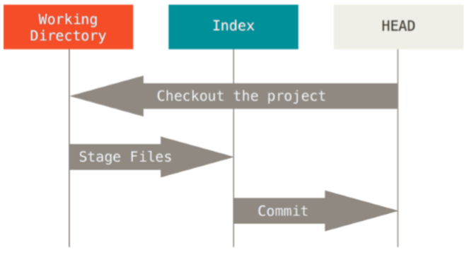

# BASIC #
### GIT WORKFLOW ###
Markdown | Less 
--- | --- 
*HEAD* | `Last commit snapshot, next parent` 
*Index* | `Proposed next commit snapshot` 
*Working directory* | `Sandbox` 

GIT WORKFLOW

THE HEAD
- pointer to the current branch reference
- parent of the next commit
- snapshot of your last commit
- stored in .git folder

THE Index
- proposal next commit
- current working which is finished by git commit
- stored in .git folder
- files added to git

The Working Directory
- sandbox
- all files tracked and untracked
